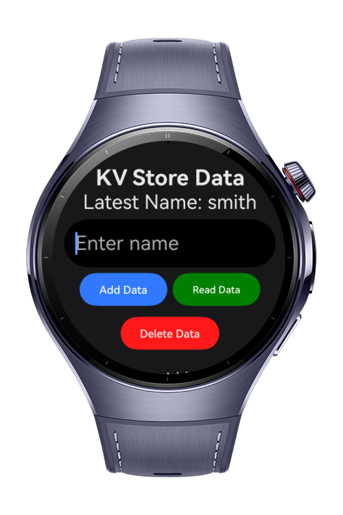
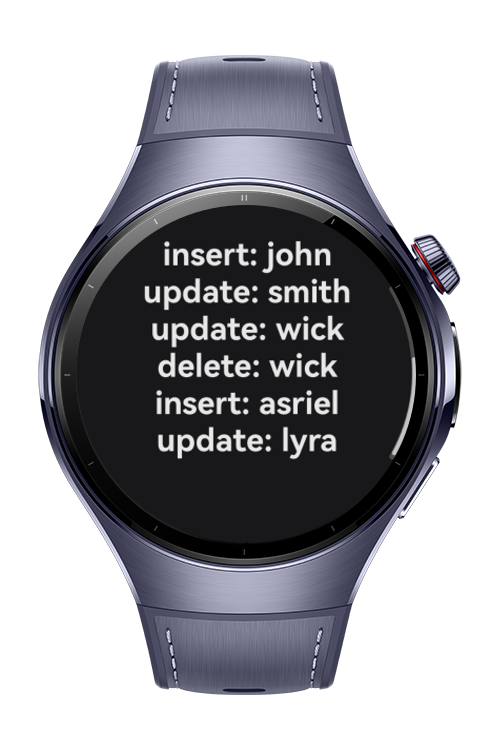

> **Note:** To access all shared projects, get information about environment setup, and view other guides, please visit [Explore-In-HMOS-Wearable Index](https://github.com/Explore-In-HMOS-Wearable/hmos-index).

# How to store key-value data

Simple KV Store Data usage

# Preview
<div>


</div>

# Use Cases

KV Store show how to store sample data and listening to these data changes.

# Tech Stack

- **Languages**: ArkTS, ArkUI
- **Frameworks**: HarmonyOS SDK 5.1.0(18)
- **Tools**: DevEco Studio Version 5.1.0.828
- **Libraries**: 
  - @kit.ArkUI
  - @kit.ArkData

# Directory Structure

```
entry/src/main/ets/
├───entryability                         
│       EntryAbility.ets                 
├───entrybackupability                   
│       EntryBackupAbility.ets                                   
├───lib 
│       KVManager.ets                                   
└───pages
        Index.ets
```

# Constraints and Restrictions
## Supported Device
- Huawei Watch 5

# LICENSE
**KV Store** is distributed under the terms of the MIT License.
See the [license](LICENSE) for more information. 